# 증강현실 축구 연습 어플리케이션
## Augmented-Reality-Soccer-Practice-Application
사용자가 코치의 도움없이 여러 훈련을 개인적으로 할 수 있도록 도와주는 어플리케이션입니다.

It is a soccer-practice-application that helps the user to do various training personally without the help of a coach.

### 이찬솔 이기열 이교범 최철환
## Representative email : cch01024857239@gmail.com

### 이 문서와 프로젝트는 한국산업기술대학교 컴퓨터공학부의 “종합설계”교과목에서 프로젝트“스마트 축구 연습 어플리케이션”을 수행하는  팀원(팀번호: S5-2)들이 작성한 것으로 사용하기 위해서는 팀원들의 허락이 필요합니다.
### These document and project are written by team members (Team No . S5-2) who perform the project “Augmented-Reality-Soccer-Practice-Application” in the “Graduation Thesis” course of the Korea Polytechnic University.
## Copyright 2020. "Graduation Thesis Team No .S5-2 of the Korea Polytechnic University" All document and project Cannot Be Copied Wihour Permission.

# 개발환경 (Development environment)
환경|버전
---|---|
Android Studio|3.4.2|
Aws RDS-MY SQL|8.0.15|
Ubuntu Server|18.0.4|

# 라이브러리 (Library environment)
라이브러리|버전
---|---|
Opencv|4.1.0|
Tensorflow|tensorflow_lite|

# 목차
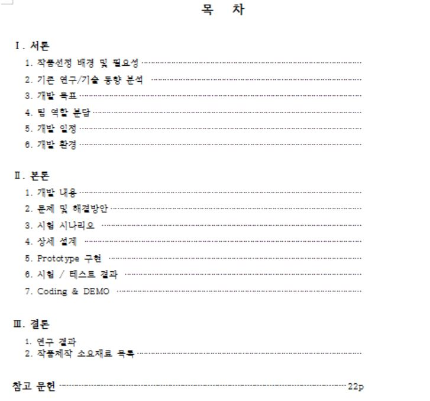

# 서론
## 1.1 작품선정 배경 및 필요성
 20세기부터 축구는 이미 세계 인기 스포츠, 시장규모, 선수 연봉에서 1위라는 순위를 유지하고 있다. 이러한 인기로 인해 축구를 배우고자 하는 사람은 수많이 존재하고 있다. 하지만 축구를 배우기 위한 레슨에는 시간당 36,000원, 유학에는 2개월에 약 360만 원이라는 고비용이 필요하다. 보다 적은 비용으로 혼자 다양한 연습을 할 수 있는 대안이 필요하고, 코치 없이 실시간으로 피드백을 받을 수 있는 환경이 필요하다고 생각하여 졸업작품으로 선정하였다. 

## 1.2 기존 연구/기술 동향 분석
 관련 제품으로는 스마트폰을 이용한 농구 연습 어플리케이션인 홈코트가 존재한다. 이 제품은 증강현실을 이용하여 혼자서 슛, 드리블의 훈련이 가능한 농구 연습 어플리케이션으로 인공지능을 이용한 자세 교정을 통해 비싼 코치 없이 혼자 연습이 가능하다는 장점을 갖고 있다. 하지만 연습 가능한 스포츠가 농구로 한정되어 있다.

## 1.3 개발 목표
 최종 목표로는 스마트 축구 연습 어플리케이션을 개발하여, 보다 적은 비용으로 다양한 연습을 도와줌과 동시에 개인 단위로 혼자 연습할 수 있는 환경을 만들어 주는 것이다. 단계별로 들어가자면 일단 opencv를 이용하여 파이참 환경에서 구현해 본 뒤, 안드로이드 스튜디오 환경에서 공을 인식하여 공의 궤적과 속력, 도착한 지점 등을 영상 처리를 통한 시각화 구현과 간단한 UI 작성과 서버 구축이다. 다음 단계로는 opencv와 tensorflow_lite를 이용한 자세 인식구현 및 자세 인식의 신경망 및 딥러닝 구축으로 안드로이드 스튜디오 환경에서 신경망의 기본 형식을 구현한 후 CNN을 이용하여 세부적인 부분을 추가하여 신경망을 구축한다. 그 후 사용자의 자세를 신경망에 학습된 자세와 비교하여 사용자의 자세를 교정하는 것을 구축한다. 마지막 단계로는 1단계에 간단히 작성되었던 UI를 좀 더 사용자 편의에 맞게 구축하고 어플리케이션으로 쉽게 연습 선택, 영상 시청, 연습 기록을 수치화 등의 기능을 제공하고 서버에 저장된 영상을 사용자에게 제공할 수 있게 인터페이스를 구축한다. 

## 1.4 팀 역할 분담
 역할 분담으로는 인공지능, 영상처리, 앱 UI 작성, DB 및 서버 구축으로 4개로 나누어 각자 2개씩 맡음으로써 혼자서 해결하기 어려운 문제나 막히는 부분을 상호보완하여 해결할 수 있도록 하였다. 각자 역할로는 이찬솔 인공지능-영상처리, 이기열 영상처리-DB 및 서버 구축, 이교범 인공지능-영상처리, 최철환 앱 UI 작성-DB 및 서버 구축을 맡도록 하였다. 산출물 관리는 개인 PC와 구글드라이브, 개인 메일로 3개에 공간에 백업, 보관하며 코드작성은 Github를 활용하여 수정 부분을 알 수 있도록 하였다.

## 1.5 개발 일정 
 개발 일정은 다음의 표대로 진행할 수 있도록 일정을 잡았고 매주 금요일마다 만나 서로 작성한 것을 공유하고 진행 상황을 알 수 있도록 하였다.

## 1.6 개발 환경
 개발 환경으로는 앱을 작성할 수 있도록 안드로이드 스튜디오를 사용하고 언어로는 자바를 사용하여 작성한다. 사용하는 스튜디오 버전은 3.4.2이다. 안드로이드 타깃은 최소 8.1(오레오)_API Level 27 으로, 최대 타깃은 10.0(안드로이드 10)_API Level 29이다. 다음으로 DB는 아마존에서 제공하는 AWS-RDS를 사용하여 MY-sql DB를 구축하고 서버와 연동할 수 있도록 하였다. 사용 언어로는 sql문을, 버전은 8.0.15를 사용한다. 서버 역시 마찬가지로 아마존에서 제공하는 AWS-EC2를 사용해 unbuntu 환경을 구축하고 사용 언어로 c++을 사용하여 버전 18.0.4에 구축한다. 마지막으로 영상처리, 인공지능 부분은 파이참 환경에서 파이썬을 가지고 작성할 것이다. 버전은 2019.3버전을 사용한다.
 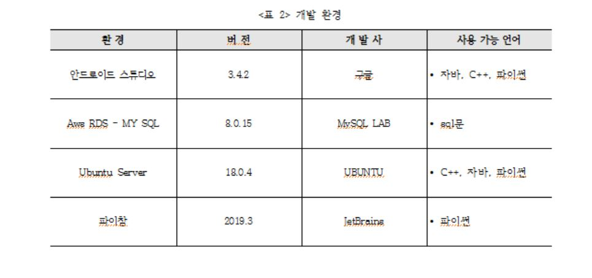

# 본론
## 2.1 개발 내용
### UI
 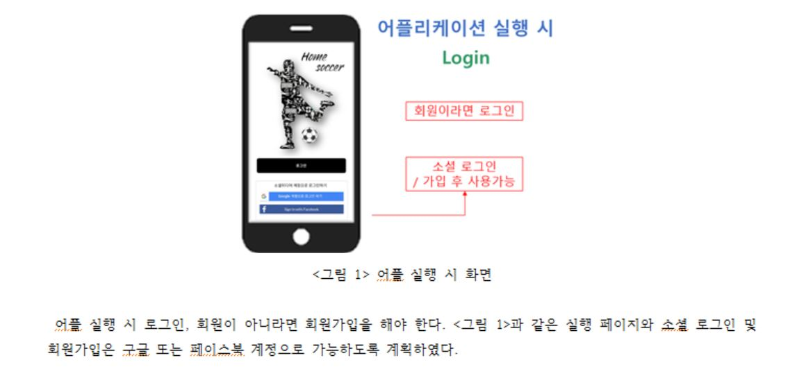
 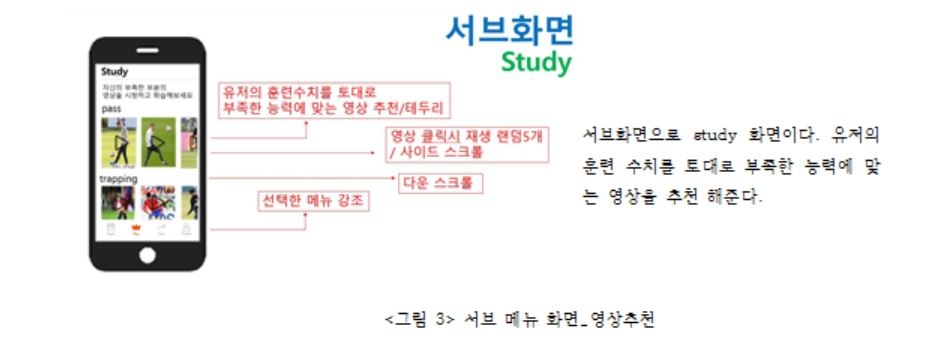
 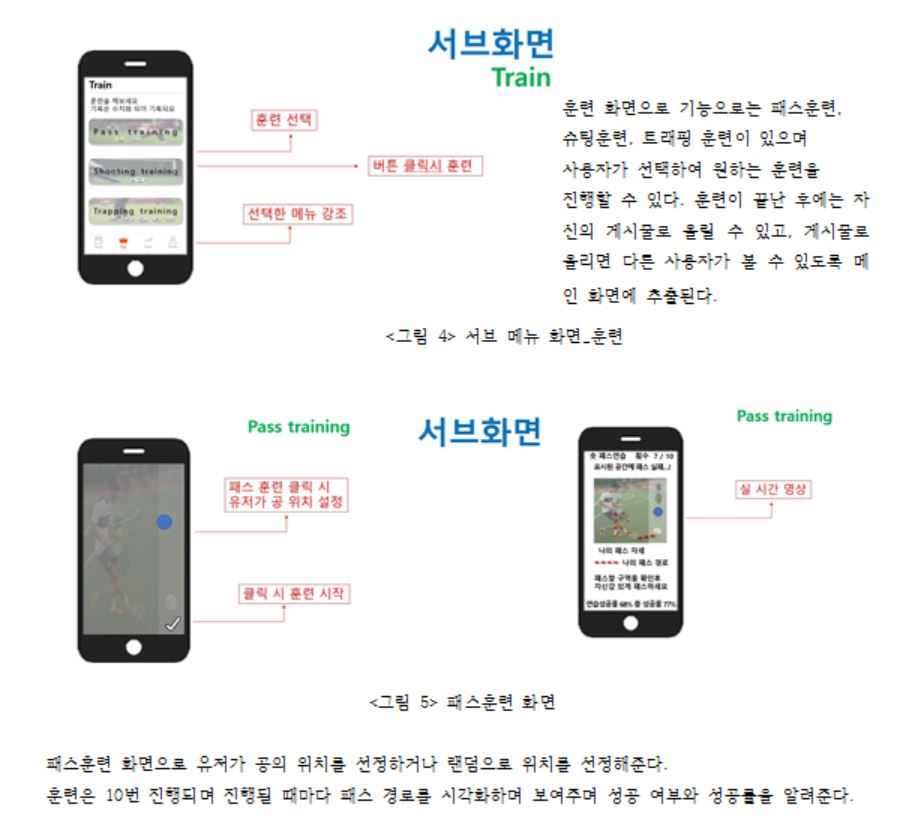
 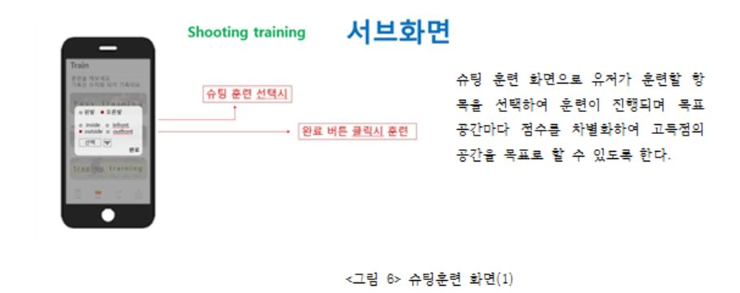
 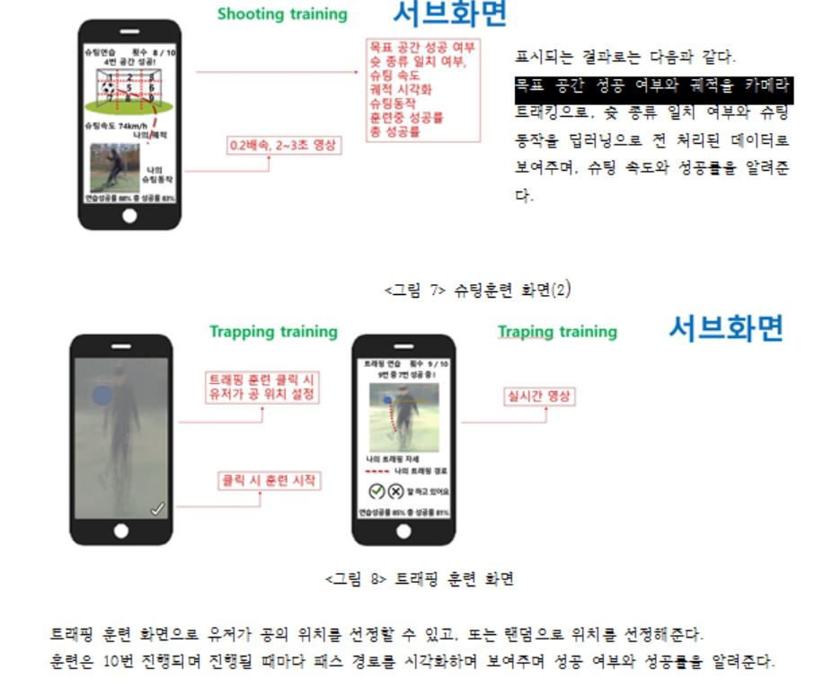
 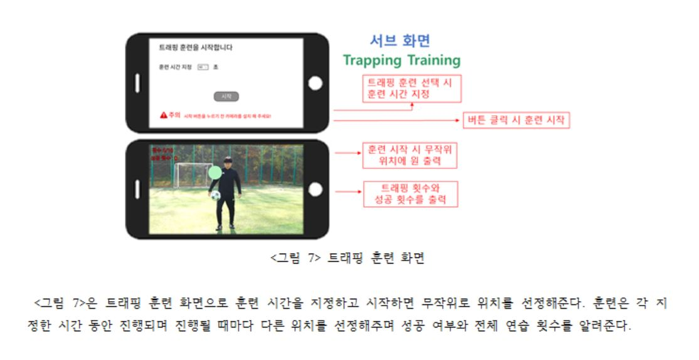
 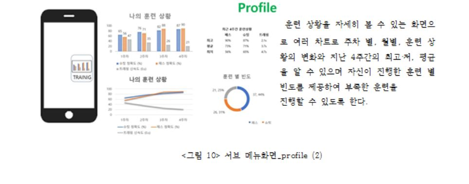
 

### 영상 처리
  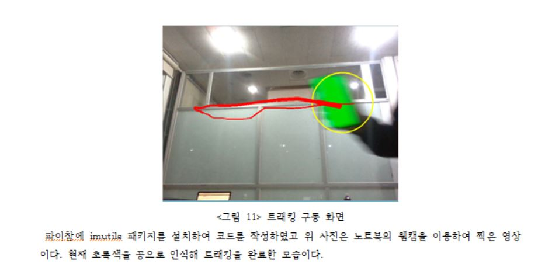

### 서버 구축
  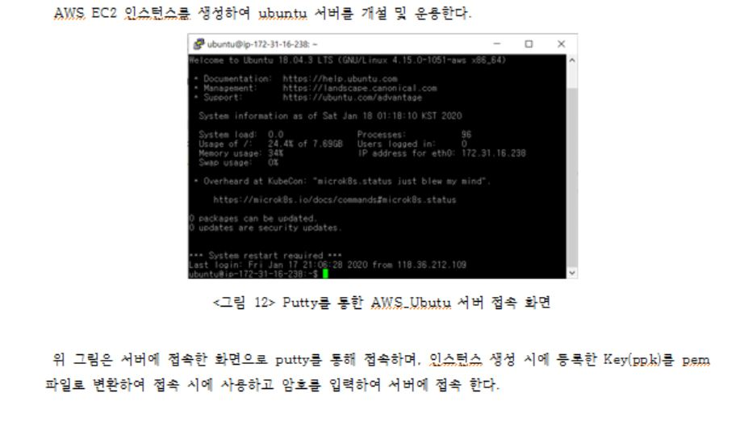
  
 
## 2.2 문제 및 해결방안
 1. Ubuntu 서버와 Mysql DB간에 보안으로 인한 접속 문제가 발생하였다. 이를 해결한 방법으로는 Mysql DB에 접속할 특정 IP를 인바운드 규칙에서 허용하여 해당 IP주소에서 DB에 접속할 수 있도록 함으로써 해결해야 했다. 
 2. 공 트래킹을 할 때 색을 따라 트래킹을 하도록 하였는데 이 방식이 아닌 원이나 아니면 축구공을 인식할 다른 방법을 찾아서 트래킹을 하는 방법이 필요하였다. 원 검출을 이용하기 위해서 안드로이드 openCV의 Imgproc.HoughCircles함수를 이용하여 원을 검출하였다
 3. 궤적을 그려줄 때 공의 반지름이 작아질 경우 슈팅을 하였다고 인식하여 궤적이 표시되게 하려고 했으나 빠른 속도로 처리를 하는 만큼 반지름의 크기가 순서대로 저장되지 않아 올바른 궤적을 그려줄 수 없었다. 궤적을 그려주는 것을 좌표를 이용하여 슈팅한 것을 인식하도록 수정하였다.
 4. 자바와 Python 연동 문제로는 Kivy를 이용하여 안드로이드 위에 파이썬 코드를 올리는 방법을 이용하여 해결하려 했으나 카메라 제어 문제로 파이썬 openCV 코드를 안드로이드 openCV로 변환하여 해결하였다
## 2.3 시험 시나리오 
총 5가지의 시나리오를 진행하였다. 
 첫 번째로, openCV 라이브러리를 이용하여 공 감지로 카메라에서 초록색 물체를 감지하게 되면 초록색 물체를 공으로 인식한 후 그 테두리에 원을 그려준다. 
 두 번째로, 인식한 공이 움직일 때 움직임을 감지하여 이동 경로를 따라 궤도를 표시, 저장, 출력한다.
 세 번째로, tensorflow_lite의 posenet 라이브러리를 이용하여 사람 관절을 인식하게 되면 관절을 랜드마크로 인식한 후 표시한다.
 네 번째로, 속력을 구하기 위해 거리를 구하는데 카메라로 보이는 골대 높이를 측정하여 각각 거리마다 저장한다. 충분히 쌓인 데이터를 통해 최소 자승법을 이용하여 회귀분석을 통한 골대 높이-거리의 함수를 구하고 실제 이용 시에는 골대높이를 측정하고 함수를 이용하여 거리를 구한 후 속력을 구한다.
 다섯 번째로, 서버 통신으로 aws-ec2를 이용하여 ubuntu 서비스를 구축한 후 서버에서 my-sql을 이용하여 db를 수집한다. 그 후 서버에서 aws-rds를 연동하여 db에 저장한다. 마지막으로 애플리케이션 통신으로 사용자가 애플리케이션을 통해 요구사항을 입력하게 되면 입력된 데이터를 db에 저장한다.
# 2.4 상세 설계
 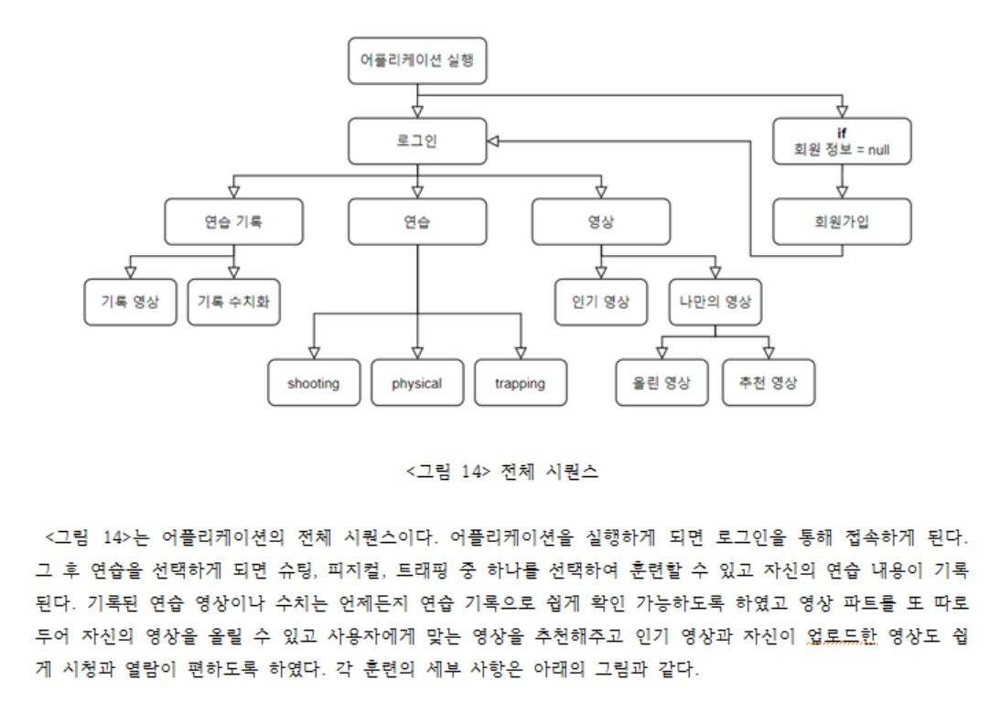
 
 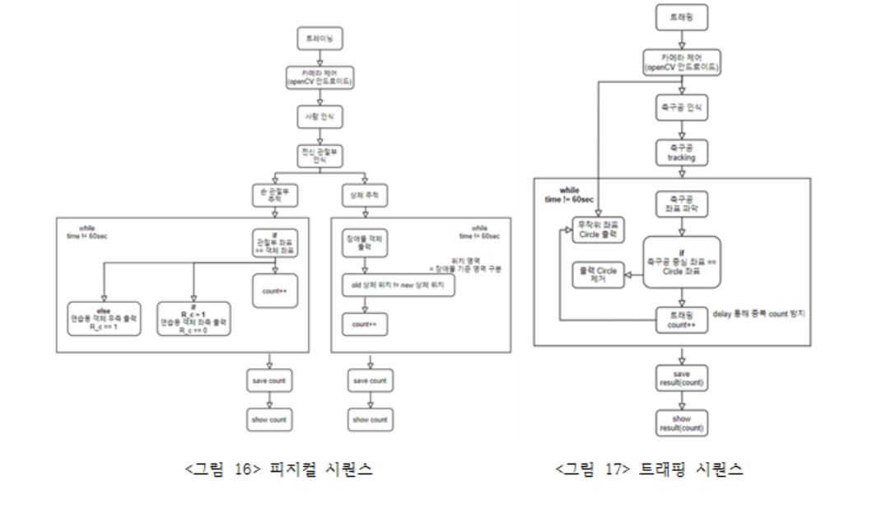
## 인식
 동작의 순서는 위의 시퀀스 대로 진행이 되도록 설계를 하였고 내부 코드로 들어가면 다음과 같다. 일단 공과 골대 인식 같은 경우에는 opencv를 이용하여 인식한다. 인식할 때에는 색상을 통해 인식하며 이를 위해 HSV 색상변경을 하고 특정 색상 값을 마스크로 지정하여 트래킹을 진행하게 된다. 그 후 공의 경우 슈팅 인식은 지면에서 떨어졌을 경우라고 생각을 하고 y좌표가 감소할 때에 궤적을 그려주게 된다. 모션 인식의 경우에는 tensorflow_lite의 posenet 라이브러리를 이용하여 인식하게 된다. 그래서 사용자의 관절을 인식할 수 있게 되고 인식한 관절을 통해 지면과의 각도나 관절들 간의 각도를 이용하여 올바른 자세의 피드백이 가능하도록 해준다.
 ## 수치화
 인식한 내용으로 사용자의 기록을 수치화해준다. 수치화는 모든 연습에서 진행이 되며 각각의 연습에서 얻는 내용을 다르게 하였다. 일단 자신의 기록을 그대로 저장해 주는 것은 물론이고 슈팅 연습의 경우에는 공의 속력을 이용하여 사용자의 슈팅 파워를 측정한다. 속력을 구하기 위해 거리를 구해야 하는데 카메라로 보이는 골대 높이를 측정하여 각각 거리마다 저장한다. 충분히 쌓인 데이터를 통해 최소 자승법을 이용하여 회귀분석을 통한 골대 높이-거리의 함수를 구하고 실제 이용 시에는 골대 높이를 측정하고 함수를 이용하여 거리를 구한 후 속력을 구한다. 우리가 구한 함수는 y=12.925x-1으로 결정계수 R2, 즉 신뢰도가 97%라는 결과를 내었다. 공이 골대에 들어간 횟수와 골대를 9등분 하였을 때 외곽에 가깝게 위치할수록 높은 점수를 주어 사용자의 정확성을 기록한다. 피지컬 연습의 경우에는 체력, 순발력 연습이 존재하는 데 시간을 기준으로 각각의 연습을 통해 점수를 얻고 그 점수를 통해 사용자의 순발력이나 체력을 측정한다. 트래핑 연습은 화면에 공을 보내야 하는 위치를 동그라미로 표시를 해주어서 자신이 원하는 곳에 한 번의 터치로 보낼 수 있는 능력을 기르는 데에 의의를 둔다. 트래핑 연습에서의 점수는 시간을 기준으로 이용하여 사용자의 트래핑 능력을 측정한다. 수치화는 각각 훈련 별로, 주차별로 저장, 출력하여 사용자가 어느 훈련을 얼마큼 했는지, 어느 훈련이 부족한지 알 수 있게 하고, 주차별로 훈련계획을 세울 수 있도록 출력한다.
## 딥러닝
  딥러닝은 다음의 방식으로 설계하였다. 먼저 일반적인 FCNN과 CNN의 가장 큰 차이점을 알아야 한다. CNN은 이미지 인식에 있어 이미지의 모든 픽셀을 분석하지 	않고 지역적, 공간적 상관관계를 고려한 학습을 한다. 따라서ﾠ효과적으로 Data-representation을 수행하고 이를 통해 분류 작업에 있어 높은 성능을 보인다. 매트랩을 활용한 CNN으로 좋은 자세의 데이터를 획득한다. 데이터 전처리는 유튜브를 통해 얻은 슈팅 방법별 영상을 다운로드, 편집하여 데이터를 확보하였다. 모델 설계는 분석을 위해 최소한의 CNN 구조를 2conv 계층, 1fcnn 계층으로 구성하였다. 학습 과정으로는 over fitting을 방지하기 위해 early stopping을 하였다.
## 데이터베이스
 데이터베이스의 설계는 다음과 같다. 회원 정보 테이블은 닉네임을 기본, 외래키로 지정하고 이름 핸드폰 생년월일 이메일 sns 회원 번호를 스키마로 지정한다. 사용자 영상 테이블은 영상번호를 기본 키로 회원 번호+닉네임을 외래키로 가지며 사용자 영상 날짜 사용자 능력(수치화)-슛, 피지컬, 트래핑을 스키마로 지정한다. 슈팅 테이블은 영상 이름을 기본 키로 슛 이름 영상(URL), 추천 능력치를 스키마로 지정하고 코멘트 테이블은 코멘트 번호를 기본 키, 영상번호를 외래키, 닉네임을 스키마로 좋아요 테이블은 좋아요 번호를 기본 키, 영상번호를 외래키, 닉네임을 스키마로 지정한다.
 
 
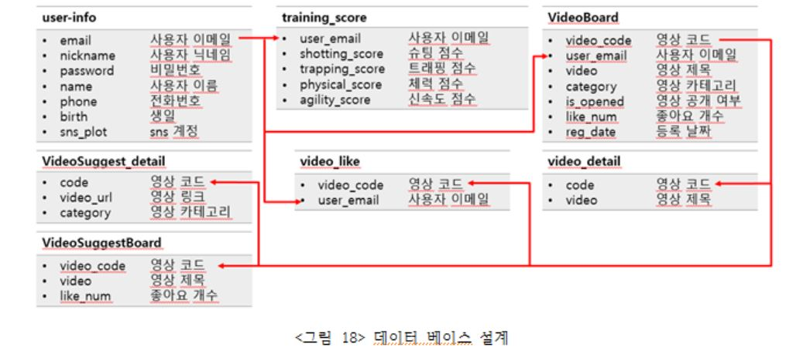
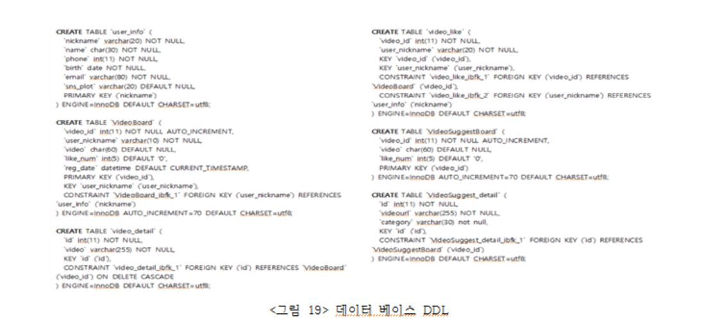
## UI
 마지막으로 <그림 20>는 UI의 상세 설계이다.
 
 

# 참고 문헌
*  [앱과 DB연동](https://docs.aws.amazon.com/ko_kr/elasticbeanstalk/latest/dg/java-rds.html)
*  [외부 클라이언트와 DB서버 연결](https://docs.aws.amazon.com/ko_kr/AmazonRDS/latest/UserGuide/USER_VPC.html)
* [딥러닝 라이브러리 언어별 종류](https://aikorea.org/blog/dl-libraries)
* [딥러닝에 대해](http://t-robotics.blogspot.com/2015/05/deep-learning.html#.XfOaHegzaUk)
* [트래킹 코드](https://diy-project.tistory.com/96)
* [공 관련 메소드](https://liveupdate.tistory.com/281)
* [open cv ROI 추출](https://yeolco.tistory.com/57)
* [Openpose라이브러리](https://m.blog.naver.com/worb1605/221297566317)
* [Imgproc.HoughCircles 함수](http://docs.opencv.org/2.4/doc/tutorials/imgproc/imgtrans/hough_circle/hough_circle.html)
* [안드로이드  tensorflow_lite에 대해](https://github.com/tensorflow/examples)
* [최소자승법에 대해](https://m.blog.naver.com/PostView.nhn?blogId=moojigai07&logNo=120186757908&proxyReferer=https%3A%2F%2Fwww.google.com%2F)
* [어플리케이션 와이어프레임 figma](https://www.figma.com)
* [CNN에 대해](https://untitledtblog.tistory.com/150)
* > Haar-like feature 프로토타입 관련-2011_송자혜,장연진_강원대학_IT대학 전기전자공학부 전기전자공학 졸업논문
